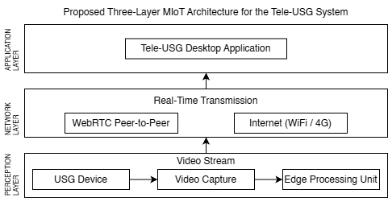
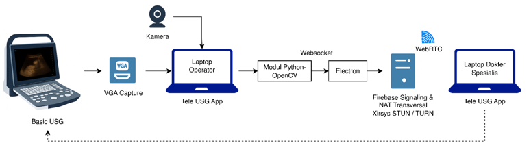
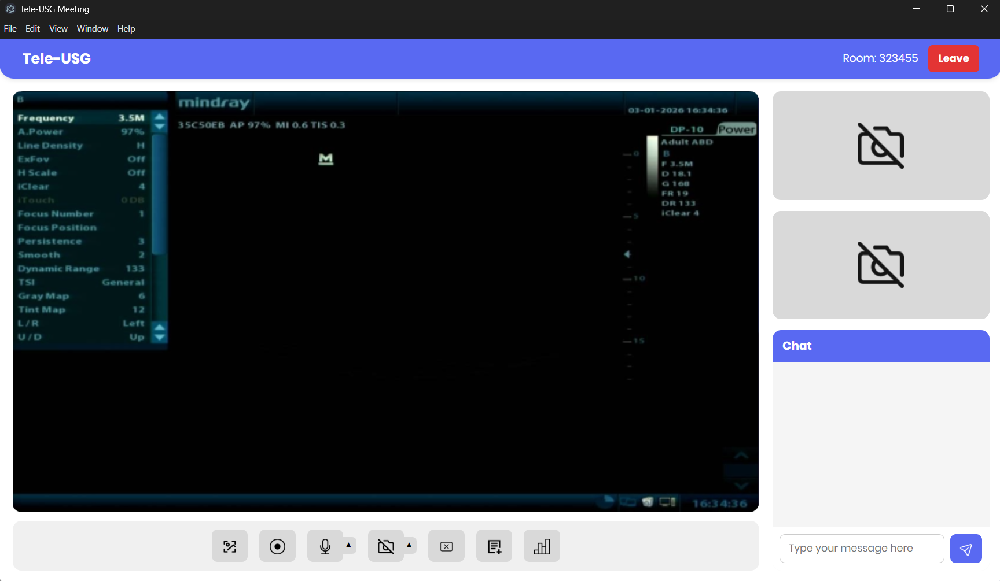

# Tele-USG (Medical Internet of Things-Based Tele-Ultrasonography)

**Tele-USG** is a telemedicine system based on the *Medical Internet of Things (MIoT)* architecture designed to enable **real-time** communication and diagnostic guidance between ultrasound operators (e.g., at primary healthcare facilities) and medical specialists (e.g., at referral hospitals) over local networks or the internet (WiFi/4G Cellular).

The application is independent of third-party platforms like Zoom or Google Meet. This system is built using the **WebRTC (Web Real-Time Communication)** protocol, ensuring low-latency asynchronous *peer-to-peer (P2P)* video communication with built-in encryption.

## System Architecture

This project is built using a three-layer MIoT architecture that integrates **Edge Computing** concepts:

1.  **Perception Layer**: Utilizes a real ultrasound machine (Mindray DP-10) with VGA output. The video signal is captured using an external PC or laptop via a USB Capture Card, along with a webcam to show the ultrasound operator.
2.  **Network Layer**: Uses a signaling server (Firebase) for Session Description Protocol (SDP) exchange and *Interactive Connectivity Establishment (ICE)* negotiation (STUN/TURN) to traverse network boundaries (NAT Traversal). Ultrasound media streaming (Video/Audio) utilizes WebRTC Peer-to-Peer communication. The client application also uses WebSockets to handle local data streaming on the Edge Gateway.
3.  **Application Layer**: An interactive Desktop-based application (Electron.js) for both the operator and the specialist, supporting high-speed video exchange, remote session control, and real-time Quality of Service (QoS) parameter monitoring such as Delay, Throughput, Packet Loss, and Jitter.

### Edge Computing at the Operator Side

The system processes ultrasound video at its source *(edge gateway)*. Visual extraction from the VGA input is performed by *Python OpenCV*, followed by standalone pre-processing (JPEG compression and resizing to 720p at 20 FPS). The data is packaged and forwarded to the Electron.js Desktop application via a local transport server (WebSocket) before finally being transmitted over the network via WebRTC. This minimizes delay and network payload load.

---

## Development History (Changelog)

The Tele-USG application has been developed iteratively to achieve optimal telemedicine communication efficiency. Here is the evolution of this project:

### v1 (Concept & Prototyping Phase)
- Initial implementation of ultrasound image capture using a separate Python script (`OpenCV`).
- Early prototype of WebRTC *Peer-to-Peer* (P2P) connection implementation using the `aiortc` module in a Python environment.
- Initial signaling trials utilizing a cloud server from Firebase.
- Basic introduction of AI Models for future research integration.

### v2 (Web-Based Tele-USG Server)
- Transitioned to form a complete, integrated Web Interface-based system.
- Used **Flask (Python)** as the Web Server (serving HTML, JS) for *real-time* communication.
- Initial socket connectivity was laid on this foundation as a locally executable or network-distributed application.

### v3 (First Transition to Desktop App)
- Adopted modern desktop application technology using **ElectronJS** and **Express** (Node.js) as the local UI backend.
- VGA Ultrasound capture processing remains handled by Python running as an asynchronous support process (`python_usg`).
- Began designing a user-friendly graphical interface for Desktop users (*Operator / Specialist*).

### v4 & v5 (Desktop App Enhancement & Refinements)
- **v4**: Overhaul and redistribution of the ElectronJS `renderer` processes. Implemented a user file system structure, advanced styling, and UI/UX improvements to support diagnostic comfort.
- **v5**: Drastic addition of UI functionality and pre-preparation of files for production release build. Stabilized transmission between NodeJS processes and local Python WebSockets.

### v6 (Final Release - Full Desktop & Advanced Features)
- **Standalone App Production**: Built an `.exe` installer for Windows environments using `electron-builder`.
- **Optimal Portability**: Added `python_portable` integration, allowing end-users' PCs to directly run the embedded Python ultrasound capture without requiring manual Python installation from scratch.
- **Advanced Network Features**: Automatic *Tunneling* integration using `ngrok` to create secure HTTP bridges without manual local port forwarding, combined with Firebase RTC communication. Also provided Cloud Storage integration (`cloudinary` and Firebase Storage) for patient image history/data storage scenarios.
- **Caliper Measurement Tool**: Implemented advanced clinical *Canvas Drawing* features, allowing specialists to capture frozen ultrasound images and perform interactive spatial measurements with visual calibration akin to a real ultrasound device, sent back via an *IPC handler* to the operator's chat room.

---
*This project is part of The Initial Development of Integrated Add-On Tele-Ultrasonography for Monitoring the Health of Pregnant Women and Fetuses in the Community Health Centers in Indonesia.*

*H. Susanti, S. Setiyadi, D. Puspitasari, F. Alia, and M. R. S. Ramadhan, ”The Initial Development of Integrated Add-On Tele-Ultrasonography for Monitoring the Health of Pregnant Women and Fetuses in the Community Health Centers in Indonesia: -,” J. Eng. Technol. Sci., vol. 57, no. 6, pp. 859-874, Nov. 2025.*